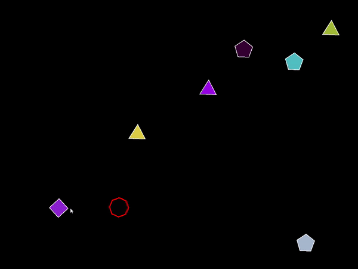
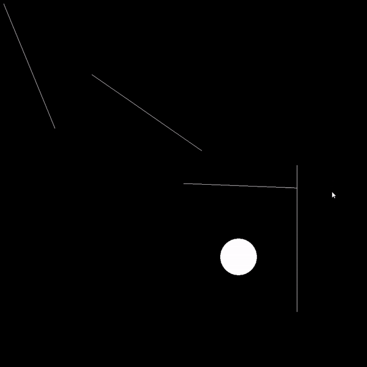
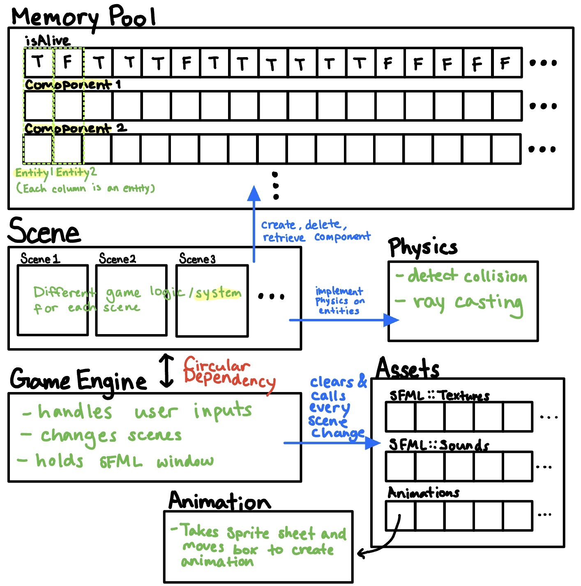

# SFML Game Engine
Game Engine for PC that supports classic 2D arcade games such as the original Super Mario Bros. etc. The engine is built with C++ and the external library SFML.

As the games that will be built by this engine are simple 2D arcade games, my main goal of this project is to design and build a Gameplay Foundation System that can be reused throughout the engines. Other functionalities that must be implemented and are not supported by SFML include collision detection, physics, animation, AI, cameras, resource manager, etc.

### More Details
https://www.notion.so/SFML-2D-Game-Engine-cfda2015512e40ba94e585fe8e5b4267

# Example

# Structure of the Engine

